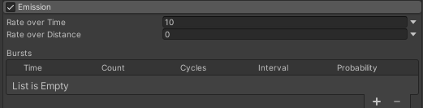

## Emission

Emissionってなんやねん  

  
↑こいつのこと

## Rate over Time

デフォルト <code>10(個/秒)</code>  
選択できる範囲 <code>0~1e+07</code>

**1秒間に何個パーティクルを出すか設定するところ**  
ただそれだけ  
シンプルにパーティクルをの放出量を増やしたいときはここの数値高くすればいい

## Rate over Distance

デフォルト <code>0</code>  
選択できる範囲 <code>0~1e+07</code>

**Particle Systemが移動したときにパーティクルを何個出すか設定するところ**  
数値高くすると少し移動しただけでめっちゃパーティクルでてくる  
移動速度が高くなるとそれに比例してパーティクルの放出間隔が狭くなる
オブジェクトが移動したときにだけパーティクル出したい時とかに使ったり、速度で間隔が決まるから一定の間隔でパーティクル出したい時に使うっぽい

##  Bursts

**決まった周期で決まった数のパーティクルを決まった回数放出させるための項目**

# Time

選択できる範囲 <code>0~Durationで設定している値(秒)</code>

**Particle Systemが再生されてから最初のバーストを発生させる時間をきめるところ**  
Start Delayと同じ感じ？多分

# Count

選択できる範囲 <code>0~999,999,994,495,727,000,000,000,000,000,000(個)</code>

**1回のバーストで出すパーティクルの量を決めるところ**  
最大数めっちゃ高いけど1000とかで普通にフリーズする

# Cycles

選択できる範囲 <code>1~Infinite(回)</code>

**バーストを何回繰り返すか決めるところ**  
カウント数を一定以上(20桁以上?)まで入れると自動的にInfiniteになる、そりゃそう

# Interval

選択できる範囲 <code>0.01~340,282,346,638,529,000,000,000,000,000,000,000,000.000(秒)</code>

**バーストを2Cycles以上にした時のワンショットごとの間隔をきめるところ**  
数値を低くすると間隔が短くなる逆に高くすると長くなる

# Probability

選択できる範囲 <code>0~1(%)</code>

**パーティクルを出す確率をいじれる**、1で100%

# 参考
[VRChatプレイヤーによるParticle System解説 ～Emission Module編～](https://qiita.com/abcde_kind/items/63e8c262df7774f12a41)  
[UnityのParticle Systemの基礎を理解する - ぷるぷるの雑記](https://prupru-prune.hatenablog.com/entry/2022/02/11/191042)  
[Unity Documentation]()