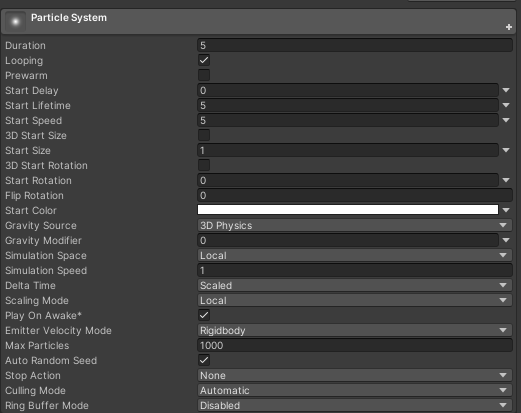

## Main Module

Main Moduleってなんやねん 

 
↑こいつのこと

# Duration

デフォルト 5(秒) 
設定できる範囲 0.05~100,000 
 
**パーティクルが何秒間出続けるか設定するところ** 
デフォルトで後述のLoopingにチェックが入ってるからチェック外したら違いがわかりやすい 
〇〇 over Lifetimeとかの指定がない状態の横軸は基本ここ

# Looping

デフォルト ON 
 
名前の通り 
Durationで設定した時間が終わったらもう一回最初から再生してくれる 
**永遠にパーティクル出してくれる**ってｺﾄ

# Prewarm

デフォルト OFF 
 
LoopingをONにしていないと使えない 
ONにすると**再生したときにループ2回目の状態から再生してくれるやつ** 
再生するとわかるけどOFFのときは原点からパーティクルでるのに対してONは元々再生してましたけど？って感じで原点からパーティクルが既に出てる状態でパーティクルが出せる

# Start Delay

デフォルト 0(秒) 
設定できる範囲 0~3.402823e+38 
 
PrewarmがOFFにしていないと使えない 
名前の通り**スタートに遅延がかけれるやつ** 
オブジェクト本体がアクティブになってから(厳密には違うらしいけどわからん)何秒後からパーティクルを出すか決めれる 
複数のParticle Systemを組み合わせてエフェクト作る時によく使うらしい

# Start Lifetime

デフォルト 5(秒) 
設定できる範囲 0.0001~3.402823e+38 

**パーティクル1つ1つの寿命が設定できるやつ** 
じゃあべつにLifetimeって名前でよくね？って思うけどこれCollisionの項目で衝突する毎にどれくらい寿命が減るかっていうのが弄れるらしい、他にもsub emitterにも関係があるとか 
だから寿命の初期設定をする項目って意味でStart Lifetimeって名前なんだろうね、多分

# Start Speed

デフォルト 5(m/秒) 
設定できる範囲 -100,000~100,000 
 
**パーティクルが出てきた時のスピードが設定できるやつ** 
シンプルだね

# 3D Start Size

デフォルト OFF 
 
触るとわかるけど**パーティクル1つ1つのスケールをXYZ個別で設定できるやつ**

# Start Size

デフォルト 1(倍) 
設定できる範囲 0~100,000 
 
3D Start SizeがOFFの時しか設定が出来ない 
こっちは3D Start Sizeとは違って**スケールのXYZを共通の値でサイズ設定ができる** 
形変える気ないならこっちの方が楽だしいいかも？

# 3D Start Rotation

デフォルト OFF 
 
触るとわかるけど**パーティクル1つ1つの角度を何度傾けるかXYZ個別で設定できるやつ**

# Start Rotation

デフォルト 0(度) 
設定できる範囲 -100,000~100,000 
 
3D Rotation SizeがOFFの時しか設定が出来ない 
こっちは3D Rotation Sizeとは違って**角度のXYZを共通の値でどのくらい傾けるかの設定ができる** 
時計回りで傾く

# Flip Rotation

デフォルト 0(%) 
設定できる範囲 0~1 
 
100%を1として**どのくらいの割合のパーティクルが左右反転してでてくるか設定できるやつ** 
左右非対称なパーティクルに使うといい感じになるらしいよ

# Start Color

デフォルト RGBA(255,255,255,1) 
 
**パーティクルが出てきたときの色** 
頂点カラーを使用しているらしい

# Gravity Source

デフォルト 3D Physics 
選択できるもの 3D Physics, 2D Physics 
 
**そもそもVRCって3Dだし弄る必要ないんじゃね？** 
一応Unity Documentationには2D または 3D 物理システムからの重力強度を使用するかどうかを指定する所って書いてあるけどまあ気にしなくてよし、3DゲームのVRCだし。

# Gravity Modifier

デフォルト 0(倍) 
設定できる範囲 -100,000~100,000 
 
**重力の影響をどのくらい受けるか設定できるやつ** 
ワールドの重力設定によって変化しちゃうから基本的にForce over Lifetimeでいじるらしい

# Simulation Space

デフォルト Local 
選択できるもの Local, World, Custom 
 
**パーティクルを親オブジェクトのローカル座標で動かすかワールド座標で動かすか設定できるやつ** 
LocalにするとParticle Systemの座標が変化したときに放出されたパーティクルも一緒に追従する 
Worldにすると発生したパーティクルはParticle Systemが動いても影響されず放出された位置が原点になる 
**オブジェクトに動きがあるものはWorld、ないものはLocal**でよさそう 
Customにすると追従先が選択できる、追従先の座標が動いたときにパーティクルも一緒に少し動くっぽい？
細かいことはわからん

# Simulation Speed

デフォルト 1(倍) 
設定できる範囲 0~100 
 
**パーティクルの動きやら放出速度やら全ての動きに対して倍率の設定ができるやつ** 
数値が小さくなると負荷が大きくなって数値を大きくすると軽くなるんだって 
パーティクル出てる状態でアニメーションとかで数値0にすると今出てるパーティクルがその場で停止できるから上手く使えばいい感じに表現できるんじゃない？しらんけど

# Delta Time

デフォルト Scaled 
 
**VRCではまず使わないらしい** 
Time Scaledの値を使用するかどうか決めるやつらしい、使わないらしいし気にする必要なし

# Scaling Mode

デフォルト Local 
選択できるもの Local, Hierarchy, Shape 
 
**Particle System全体のスケールとパーティクル1つ1つのサイズがどこのTransformに依存するか決めれるところ** 
Localだとこのオブジェクトのみ、Hierarchyにすると親のオブジェクトも、ShapeにするとShapeにのみTransformが影響しパーティクルのサイズ自体は変わらない

# Play On Awake

デフォルト ON 
 
**オブジェクトがアクティブになったときにパーティクルを再生させるか決めるやつ** 
アバターやらパーティクルライブで使う分には全く使わないんだって

# Emitter Velocity

デフォルト Rigidbody 
選択できるもの Transform, Rigidbody, Custom 
 
**粒子の速度の計算方法の指定ができるらしい** 
Rigidbodyを選択するとそれを元に速度計算、Transformで発生源の位置の変化で計算するらしい 
Rate over DistanceとInherit Velocityに使う計算方法をここで指定してるんだってさ 
おまけだけどRigidbodyって剛体って意味らしいよ、物理演算云々のやつらしい

# Max Particles

デフォルト 1000(個) 
選択できる範囲 0~2,147,483,647 
 
**同時にでるパーティクルの上限を決めるやつ** 
パーティクルの数が上限に達したら古いものから消えていく

# Random Seed

デフォルト ON 
 
**基本ONのままでいい** 
OFFにするとRandomSeedの項目が出てきてパーティクルの出方をseed値で固定出来る、右のReseedを押すとランダムでseed値を出してくれる

# Stop Action

デフォルト None 
選択できるもの None, Disable, Destroy, Callback 
 
**パーティクルの再生が終わった時にどういう動作をするか選ぶやつ** 
**LoopingついてたらNoneでいいし、ついてなくても基本Noneでよさそう** 
実際は知らないけどパーティクルライブとかで使う時はDisable使ってそうな気がする 
名前の通りNoneはなにもしない、DisableはParticle Systemのオブジェクトを非アクティブ化する 
DestroyでParticle Systemのオブジェクトを破壊(!?)する、破壊ってなに? 
CallbackはParticleSystemのオブジェクトにアタッチされたMonoBehaviourのOnParticleSystemStoppedコールバックを呼ぶ、これ使うと細かい終了判定ができるけどコード書けないと使えないよ～～ん

# Culling Mode

デフォルト Automatic 
選択できるもの Automatic, Pause and catch-up, Pause, Always Simulate 
 
**パーティクル全体のが画面外にある時パーティクルの再生をどうするかきめるやつ** 
基本はAutomaticでいいけどたまに変えることがあるらしい、どういうときに変えるのかイマイチわからん

# Ring Buffer Mode

デフォルト Disabled 
選択できるもの Disabled, Pause Until Replaced, Loop Until Replaced 
 
**Max Particlesに設定した値までパーティクルが出続けるか決めるやつ** 
Lifetimeが終わっても上限までパーティクルが残り続ける(多分) 
Max Particlesに到達すると古いものを除去し新しく出るパーティクルに使いまわしされる 
DisabledでLifetimeが終わったらパーティクル除去 
Pause Until ReplacedはLifetimeを超えたパーティクルの〇〇 over Lifetime等の最後の状態を維持 
Loop Until Replacedはパーティクルが存在してる間は指定した範囲のアニメーションを再生し続け、
上限に達して消えるパーティクルは最後までアニメーションが再生される(つまり上限を超えたパーティクルが存在することになる)

# 参考
[VRChatプレイヤーによるParticle System解説 ～Main Module編～](https://qiita.com/abcde_kind/items/82cddca8be2917c0bded) 
[UnityDocumantation](https://docs.unity3d.com/ja/2022.1/ScriptReference/ParticleSystem.MainModule-gravitySource.html) 
[【Unity】Particle System の「Simulation Space」](https://torisan-net.com/blog/2677) 
[パーティクルメインモジュールの全項目を映像付きで徹底解説します!［Unity］](https://walkable-2020.com/unity/particlesystem-main-module/#toc27) 
[ParticleSystemの再生の終了判定（StopAction）【Unity】](https://mackysoft.net/particlesystem-stopaction/)